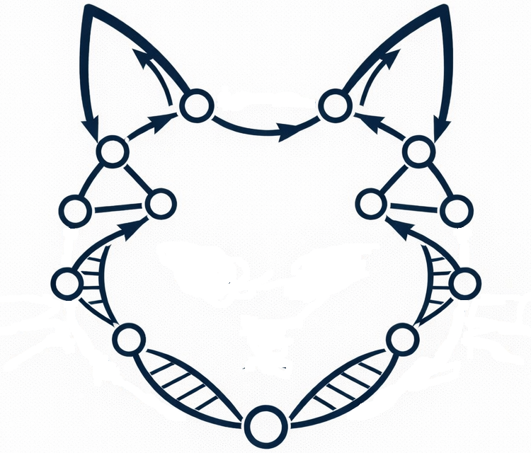

<p align="center">
  
</p>

Extracts 17 de Bruijn graph topology features from a MEGAHIT SDBG at k=21 by default.
Runs as a standalone binary after `megahit_core` has written its SDBG to disk - no re-assembly.

## Features extracted

| # | Name | Group | Why | Higher → | Lower → |
|---|------|-------|-----|----------|---------|
| 1 | valley_depth | histogram | how well errors separate from real coverage - [[Sun 2018]](https://doi.org/10.1093/bioinformatics/btx637) | valley shallow: error k-mers blend into signal; poor separation, low-quality library | deep valley: clean error/signal boundary; high-quality sequencing |
| 2 | mult_1_fraction | histogram | fraction of singleton k-mers ≈ error rate proxy - [[Sun 2018]](https://doi.org/10.1093/bioinformatics/btx637) | high error rate or very low coverage; many spurious k-mers | low error rate or deep, even coverage |
| 3 | mean_node_multiplicity | histogram | average coverage depth estimate | deep sequencing or low-complexity (few species dominate) | shallow sequencing or highly diverse community |
| 4 | multiplicity_cv | histogram | coverage evenness - high in complex metagenomes | uneven coverage: dominant species mixed with rare ones; high richness or strain imbalance | uniform community or single organism; simple composition |
| 5 | n_signal_modes | histogram | number of distinct coverage peaks ≈ strain count | multiple strains or species at distinct depths; polyploid or mixed-ploidy sample | single dominant organism or homogeneous coverage |
| 6 | primary_mode_depth | histogram | dominant sequencing depth | deeply sequenced dominant organism; or low-diversity sample | shallow dominant coverage; sparse sequencing |
| 7 | high_mult_tail_ratio | histogram | repeat content - spikes in repeat-rich genomes | repeat-rich genomes (transposons, rRNA operons); mobile elements | low repeat content; streamlined genomes (e.g. ocean bacteria) |
| 8 | tip_density | node | short dead-end paths caused by sequencing errors - [[Zerbino 2008]](https://pmc.ncbi.nlm.nih.gov/articles/PMC2336801/) | high error rate or very low coverage; many unextended k-mers | clean sequencing or deep coverage; errors well-pruned |
| 9 | branching_node_fraction | node | graph complexity - encodes diversity + repeats - [[Rizzi 2019]](https://doi.org/10.1007/s40484-019-0181-x) | high microbial diversity, many strains, or repeat-rich genomes | simple community; single organism or very low diversity |
| 10 | linear_node_fraction | node | fraction of unambiguous path - complement of branching | low diversity, few strains; graph is mostly unambiguous contigs | complex community; many branching points from variants or repeats |
| 11 | high_degree_node_fraction | node | dense junctions - repeats and chimeras | abundant repetitive elements, lateral gene transfer, or chimeric reads | few repeats; clean, well-resolved assembly graph |
| 12 | mult_at_tips | node | whether tips are low-cov errors or high-cov repeats - [[Zerbino 2008]](https://pmc.ncbi.nlm.nih.gov/articles/PMC2336801/) | tips are high-coverage: dead ends caused by repeats, not errors | tips are low-coverage: classic sequencing errors at k-mer ends |
| 13 | mult_at_branches | node | whether junctions are repeat-driven or variant-driven | branches are high-coverage repeats (rRNA, transposons) | branches are low-coverage variants or rare-strain divergence |
| 14 | mean_tip_length | walk | longer tips → more complex errors - [[Zerbino 2008]](https://pmc.ncbi.nlm.nih.gov/articles/PMC2336801/) | long erroneous extensions; indel-heavy errors or low-complexity tails | short tips; substitution-only errors, quickly dead-ended |
| 15 | bubble_density | walk | bubbles per branch ≈ variant / repeat density - [[Iqbal 2012]](https://pmc.ncbi.nlm.nih.gov/articles/PMC3272472/) | high SNP density, strain diversity, or repeat-induced false bubbles | low strain diversity; clonal or highly conserved community |
| 16 | error_bubble_fraction | walk | bubbles from errors (mult ratio > 5) - [[Zerbino 2008]](https://pmc.ncbi.nlm.nih.gov/articles/PMC2336801/) | high sequencing error rate; many false branches dominate | low error rate; most bubbles reflect real biology |
| 17 | balanced_bubble_fraction | walk | bubbles from real variants / SNPs - [[Iqbal 2012]](https://pmc.ncbi.nlm.nih.gov/articles/PMC3272472/) | high SNP density or co-existing strains at similar abundance | clonal population; little within-sample sequence variation |

## Build

Clone with submodules - MEGAHIT lives under `libs/megahit/` as a git submodule:

```bash
git clone --recurse-submodules https://github.com/feeka/metaTopoGraph.git
# or, if already cloned:
git submodule update --init --recursive
```

First build MEGAHIT.

```bash
cd metaTopoGraph/libs/megahit
mkdir -p build && cd build
cmake .. -DCMAKE_BUILD_TYPE=Release
make -j4
```

Then build `megahit_topo`.


```bash
cd metaTopoGraph/build
cmake .. -DCMAKE_BUILD_TYPE=Release
make -j4
```

Requires: CMake ≥ 3.5, C++14 compiler, zlib, OpenMP.

## Usage

```bash
# From a pre-built SDBG (megahit_core must have already run)
./megahit_topo --graph <outdir>/k21 --output features.json [--sample 100000] [--threads 8]

# From raw reads (builds SDBG at k=21, extracts features, then deletes the SDBG)
./megahit_topo --reads sample.fa --output features.json [--mem 16.0] [--min-count 2] [--threads 8]
```

| Flag | Description | Default |
|---|---|---|
| `--graph` | SDBG file prefix | - |
| `--reads` | FASTA/FASTQ input (triggers SDBG build) | - |
| `--output` | Output JSON path | required |
| `--sample` | Edges sampled for node/walk/bubble phases | 100 000 |
| `--threads` | OpenMP threads | all cores |
| `--mem` | Memory for SDBG build in GB (reads mode only) | 8.0 |
| `--min-count` | Min k-mer frequency (reads mode only) | 2 |

In reads mode, `megahit_core_no_hw_accel` (or `megahit_core`) must be present in the same directory as `megahit_topo`. The temporary SDBG is written to `<binary_dir>/megahit_topo_tmp_<pid>/` and deleted on exit.

## Python scripts

Three companion scripts cover the full dataset collection → analysis → visualisation workflow.
They require Python ≥ 3.9 and `pandas`, `numpy`, `scipy`, `matplotlib`, `seaborn`.

### `pull_and_extract.py` - bulk dataset collection

Downloads public metagenomes from NCBI SRA (via ENA direct stream or `fasterq-dump`), builds the SDBG with `megahit_topo`, and extracts features for each one.
Supports 55 biome categories out of the box; each dataset's FASTQ is deleted immediately after extraction to save disk.

```bash
# pull 1 dataset per category (55 total, default)
python pull_and_extract.py --build-dir /data/metagenomes --threads 8

# pull 2 per category (110 total), randomise spot count between 1.5M–3M
python pull_and_extract.py --n-datasets 110 --max-spots 3000000 --threads 8

# keep raw reads and the SDBG for inspection
python pull_and_extract.py --keep-fastq --keep-graph

# change k-mer size
python pull_and_extract.py --kmer-size 31
```

Key flags:

| Flag | Description | Default |
|---|---|---|
| `--build-dir` | Root output directory | `build/metaTopoGraph` |
| `--n-datasets N` | Total datasets, spread evenly across categories | 1 per category |
| `--max-spots X` | Upper spot cap; each dataset draws randomly from `[X/2, X]` | 3 000 000 |
| `--kmer-size` | k-mer length passed to SDBG build | 21 |
| `--keep-fastq` | Don't delete FASTQ after extraction | off |
| `--keep-graph` | Don't delete temporary SDBG | off |
| `--threads` | Threads for download and SDBG build | 4 |
| `--ncbi-api-key` | NCBI API key for higher rate limit (10 req/s) | - |

### `analyze.py` - descriptive statistics and correlations

Reads every `features_*.json` in a folder and produces five CSVs and five plots:
summary statistics, Pearson/Spearman correlation matrices, outlier detection, binomial confidence intervals for bubble fractions, and a hierarchical clustering heatmap.

```bash
python analyze.py --input build/metaTopoGraph/outputs --output results/
```

### `plot_features.py` - per-sample and multi-sample visualisation

Single-sample mode renders a four-panel dashboard (coverage histogram model, node topology, bubble breakdown, radar chart).
Multi-sample mode adds a PCA biplot, correlation matrix, dendrogram, and pairwise scatter matrix.

```bash
# single sample
python plot_features.py features.json

# whole directory
python plot_features.py build/metaTopoGraph/outputs/
```

## Source layout

```
CMakeLists.txt
libs/megahit/          upstream MEGAHIT (SDBG data structures, read-only)
src/
  topo_features.h      struct definitions for all 18 features
  topo_extractor.h/.cpp  extraction logic (histogram, node, walk, bubble)
  topo_json_writer.h/.cpp  writes features.json
  main.cpp             CLI entry point
```
